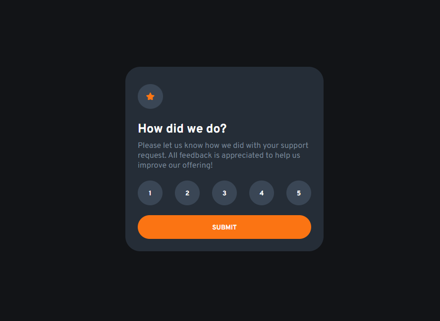
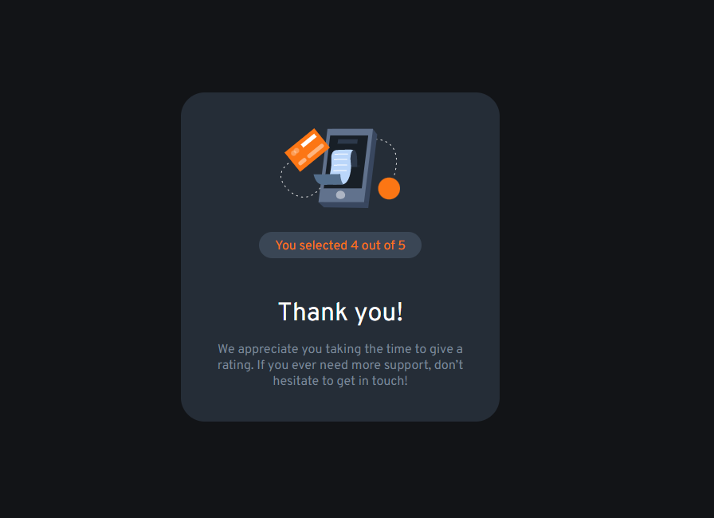

# Frontend Mentor - Interactive rating component solution

This is a solution to the [Interactive rating component challenge on Frontend Mentor](https://www.frontendmentor.io/challenges/interactive-rating-component-koxpeBUmI). Frontend Mentor challenges help you improve your coding skills by building realistic projects.

## Table of contents

- [Overview](#overview)
  - [The challenge](#the-challenge)
  - [Screenshot](#screenshot)
  - [Links](#links)
- [My process](#my-process)
  - [Built with](#built-with)
- [Author](#author)

**Note: Delete this note and update the table of contents based on what sections you keep.**

## Overview

### The challenge

Users should be able to:

- View the optimal layout for the app depending on their device's screen size
- See hover states for all interactive elements on the page
- Select and submit a number rating
- See the "Thank you" card state after submitting a rating

### Screenshot

### Links

- Solution URL: [GitHub](https://github.com/filipefpaulo/interactive-rating-component)
- Live Site URL: [GitHub Pages](https://filipefpaulo.github.io/irc-frontendmentor/)

## My process

### Built with

- [React](https://reactjs.org/) - JS library
- TypeScript
- SASS
- Flexbox
- Mobile-first workflow
- gh-pages (for deploy)

## Author

- [GitHub](https://github.com/filipefpaulo)
- [Frontend Mentor](https://www.frontendmentor.io/profile/filipefpaulo)
- [LinkedIn](https://www.linkedin.com/in/filipefpaulo/)
